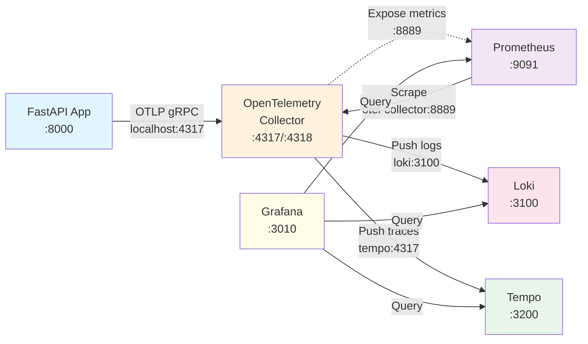

# Architecture Diagram

## Data Flow Diagram



## Port Mapping Summary

```
Host Machine                    Docker Network
============                    ==============
                               
FastAPI (:8000) ──┐            
                  │            
    localhost:4317├──────────> OTel Collector (:4317)
                               ├─> Tempo (:4317)
                               ├─> Loki (:3100)
                               └─> Prometheus (scrapes :8889)
                               
    localhost:3010 ──────────> Grafana (:3000)
    localhost:9091 ──────────> Prometheus (:9090)
    localhost:3200 ──────────> Tempo (:3200)
    localhost:3100 ──────────> Loki (:3100)
```
